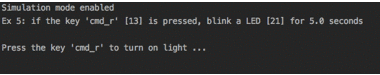
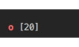
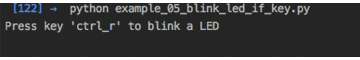

======
README
======

.. _Darth-Vader-RPi project: https://github.com/raul23/Darth-Vader-RPi
.. _let me know through pull requests: https://github.com/raul23/SimulRPi/pulls
.. _RPi.GPIO: https://pypi.org/project/RPi.GPIO/
.. _run_examples.py: #script-run-examples-py

..
   TODO: change URL for SimulRPi.GPIO that points to its documentation

..
   image:: https://raw.githubusercontent.com/raul23/SimulRPi/master/docs/_static/images/SimulRPi_logo.png
   :target: https://raw.githubusercontent.com/raul23/SimulRPi/master/docs/_static/images/SimulRPi_logo.png
   :align: center
   :alt: SimulRPi logo

.. raw:: html

   

.. image:: https://readthedocs.org/projects/simulrpi/badge/?version=latest
   :target: https://simulrpi.readthedocs.io/en/latest/?badge=latest
   :alt: Documentation Status

.. image:: https://travis-ci.org/raul23/SimulRPi.svg?branch=master
   :target: https://travis-ci.org/raul23/SimulRPi
   :alt: Build Status

**SimulRPi** is a library that partly fakes
`RPi.GPIO <https://pypi.org/project/RPi.GPIO/>`_ and simulates some I/O devices
on a Raspberry Pi (RPi).

.. contents::
   :depth: 3
   :local:

Introduction
============
In addition to partly faking `RPi.GPIO <https://pypi.org/project/RPi.GPIO/>`_,
**SimulRPi** also simulates these I/O devices connected to an RPi:

- push buttons by listening to keys pressed/released on the keyboard and
- LEDs by displaying small dots blinking on the terminal along with their GPIO \
  pin number.

When a LED is turned on, it is shown as a small red circle on the terminal. The
package `pynput <https://pynput.readthedocs.io/>`_ is used to monitor the
keyboard for any pressed key.

**Example: terminal output**

..
   image:: https://raw.githubusercontent.com/raul23/images/master/Darth-Vader-RPi/terminal_leds_active.gif
   :target: https://raw.githubusercontent.com/raul23/images/master/Darth-Vader-RPi/terminal_leds_active.gif
   :align: center
   :alt: Simulating LEDs on an RPi via a terminal

.. raw:: html

   

   
   
<b>Simulating LEDs on an RPi via a terminal</b>

   

Each circle represents a blinking LED connected to an RPi and the number
between brackets is the associated GPIO channel number. Here the "LED" on
channel 22 toggles between on and off when a key is pressed.

`:warning:`

      This library is not a Raspberry Pi emulator nor a complete mock-up of 
      `RPi.GPIO`_, only the most important functions that I needed for my 
      `Darth-Vader-RPi project`_ were added.

      If there is enough interest in this library, I will eventually mock more
      functions from `RPi.GPIO`_. Thus, `let me know through pull requests`_ if
      you want me to add more things to this mock library.

Dependencies
============
* **Platforms:** macOS, Linux
* **Python**: 3.5, 3.6, 3.7
* ``pynput`` >=1.6.8: for monitoring the keyboard for any pressed key

Installation instructions
=========================
1. Install the ``SimulRPi`` package with *pip*::

   $ pip install -i https://test.pypi.org/simple/ --extra-index-url=https://pypi.org/simple/ SimulRPi

   It will install the dependency ``pynput`` if it is not already found in your system.

2. Test your installation with::

   $ python -c "import SimulRPi; print(SimulRPi.__version__)"

   Check that the version is the latest one.

Usage
=====
Use the library in your own code
--------------------------------
Case 1: with a ``try`` and ``except`` blocks
~~~~~~~~~~~~~~~~~~~~~~~~~~~~~~~~~~~~~~~~~~~~
You can try importing ``RPi.GPIO`` first and if it is not found, then fallback
on the mock module ``SimulRPi.GPIO``.

.. code-block:: python

   try:
       import RPi.GPIO as GPIO
   except ImportError:
       import SimulRPi.GPIO as GPIO

   # Rest of your code

The code from the previous example would be put at the beginning of your file
with the other imports.

Case 2: with a simulation flag
~~~~~~~~~~~~~~~~~~~~~~~~~~~~~~
Or maybe you have a flag to tell whether you want to work with the simulation
module or the real one.

.. code-block:: python

   if simulation:
       import SimulRPi.GPIO as GPIO
   else:
       import RPi.GPIO as GPIO

   # Rest of your code

Script ``run_examples.py``
--------------------------
The script ``run_examples.py`` allows you to run different code examples on
your RPi or computer. If it is run on your computer, it will make use of the
module ``SimulRPi.GPIO`` which partly fakes `RPi.GPIO`_.

The different code examples are those presented in
`Examples <#examples>`_ and show the capability of ``SimulRPi.GPIO``
for simulating I/O devices on an RPi such as push buttons and LEDS.

Here is a list of the functions associated with each code example:
   - Example 1: `ex1_turn_on_led() <https://simulrpi.readthedocs.io/en/latest/api_reference.html#run_examples.ex1_turn_on_led>`_
   - Example 2: `ex2_turn_on_many_leds() <https://simulrpi.readthedocs.io/en/latest/api_reference.html#run_examples.ex2_turn_on_many_leds>`_
   - Example 3: `ex3_detect_button() <https://simulrpi.readthedocs.io/en/latest/api_reference.html#run_examples.ex3_detect_button>`_
   - Example 4: `ex4_blink_led() <https://simulrpi.readthedocs.io/en/latest/api_reference.html#run_examples.ex4_blink_led>`_
   - Example 5: `ex5_blink_led_if_button() <https://simulrpi.readthedocs.io/en/latest/api_reference.html#run_examples.ex5_blink_led_if_button>`_

How to run the script
~~~~~~~~~~~~~~~~~~~~~
Once you install the package ``SimulRPi`` (see
`Installation Instructions <#installation-instructions>`_), you should have
access to the script ``run_examples`` which can be called from anywhere on
your terminal by providing some arguments, like this for example::

   $ run_examples -e 1 -s

The previous command will run the first example (*-e 1*) using the simulation
package ``SimulRPi`` (*-s*) and the default values for *led_channel* and
*time_led_on* (see `ex1_turn_on_led() <https://simulrpi.readthedocs.io/en/latest/api_reference.html#run_examples.ex1_turn_on_led>`_).

For a complete list of supported arguments, provide the *-h* option to show the
help message along with a description for each option and their default values::

   $ run_examples -h

Check also the `script's usage <https://simulrpi.readthedocs.io/en/latest/api_reference.html#usage>`_ from the docs for
the list of available options.

`:exclamation:`

      Don't forget the flag *-s* (for simulation) when running the script
      ``run_examples`` if you want to run a code example on your computer, and
      not on your RPi.

Run an example code
~~~~~~~~~~~~~~~~~~~
Let's run the code example **# 5** which blinks a LED if a specified key is
pressed.

Here is the command line for blinking a LED (on channel 21) for a total of 5
seconds if the key ``cmd_r`` is pressed when the simulation package
``SimulRPi`` is used::

   $ run_examples -s -e 5 -l 21 -t 5 -k cmd_r

**Output:**

Examples
========
The examples presented thereafter will show you how to use **SimulRPi** to
simulate LEDs and push buttons.

The code for the examples shown here can be also found as a script in
`run_examples.py`_.

`:exclamation:`

      Since we are showing how to use the ``SimulRPi`` library, the presented code
      examples are to be executed on your computer. However, the script
      `run_examples.py`_ which runs the following code examples can be executed on
      a Raspberry Pi or your computer.

Example 1: display 1 LED
------------------------
**Example 1** consists in displaying one LED on the GPIO channel 11. Here is
the code along with the output from the terminal:

.. code-block:: python

   import SimulRPi.GPIO as GPIO

   led_channel = 11
   GPIO.setmode(GPIO.BCM)
   GPIO.setup(led_channel, GPIO.OUT)
   GPIO.output(led_channel, GPIO.HIGH)
   GPIO.cleanup()

**Output:**

The command line for reproducing the same results for example 1 with the script
``run_examples`` is the following::

   $ run_examples -s -e 1 -l 11

`:warning:`

   Always call `GPIO.cleanup() <https://simulrpi.readthedocs.io/en/latest/api_reference.html#GPIO.cleanup>`_ 
   at the end of your program to free up any resources such as stopping threads.

Example 2: display 3 LEDs
-------------------------
**Example 2** consists in displaying three LEDs on channels 10, 11, and 12,
respectively. Here is the code along with the output from the terminal:

.. code-block:: python

   import SimulRPi.GPIO as GPIO

   led_channels = [10, 11, 12]
   GPIO.setmode(GPIO.BCM)
   for ch in led_channels:
       GPIO.setup(ch, GPIO.OUT)
       GPIO.output(ch, GPIO.HIGH)
   GPIO.cleanup()

**Output:**

The command line for reproducing the same results for example 2 with the script
``run_examples`` is the following::

   $ run_examples -s -e 2

Example 3: detect a pressed key
-------------------------------
**Example 3** consists in detecting if the key ``cmd_r`` is pressed and then
printing a message. Here is the code along with the output from the terminal:

.. code-block:: python

   import SimulRPi.GPIO as GPIO

   channel = 17
   GPIO.setmode(GPIO.BCM)
   GPIO.setup(channel, GPIO.IN, pull_up_down=GPIO.PUD_UP)
   print("Press key 'cmd_r' to exit")
   while True:
       if not GPIO.input(channel):
           print("Key 'cmd_r' pressed")
           break
   GPIO.cleanup()

**Output:**

The command line for reproducing the same results for example 3 with the script
``run_examples`` is the following::

   $ run_examples -s -e 3 -k cmd_r

`:warning:`

      By default, **SimulRPi** maps the key ``cmd_r`` to channel 17 as can be
      seen from the `default key-to-channel map
      <https://github.com/raul23/SimulRPi/blob/master/SimulRPi/mapping.py#L105>`_.

      See also the documentation for `SimulRPi.mapping <https://simulrpi.readthedocs.io/en/latest/api_reference.html#module-SimulRPi.mapping>`_ 
      where the default keymap is defined.

Example 4: blink a LED
----------------------
**Example 4** consists in blinking a LED on channel 20 for 4 seconds (or until
you press ``ctrl`` + ``c``). Here is the code along with the output from
the terminal:

.. code-block:: python

   import time
   import SimulRPi.GPIO as GPIO

   channel = 20
   GPIO.setmode(GPIO.BCM)
   GPIO.setup(channel, GPIO.OUT)
   start = time.time()
   while (time.time() - start) < 4:
       try:
           GPIO.output(channel, GPIO.HIGH)
           time.sleep(0.5)
           GPIO.output(channel, GPIO.LOW)
           time.sleep(0.5)
       except KeyboardInterrupt:
           break
   GPIO.cleanup()

**Output:**

The command line for reproducing the same results for example 4 with the script
``run_examples`` is the following::

   $ run_examples -s -e 4 -t 4 -l 20

Example 5: blink a LED if a key is pressed
------------------------------------------
**Example 5** consists in blinking a LED on channel 10 for 3 seconds if the key
``ctrl_r`` is pressed. And then, exiting from the program. The program can
also be terminated at any time by pressing ``ctrl`` + ``c``). Here is the
code along with the output from the terminal:

.. code-block:: python

   import time
   import SimulRPi.GPIO as GPIO

   led_channel = 10
   key_channel = 20
   GPIO.setmode(GPIO.BCM)
   GPIO.setup(led_channel, GPIO.OUT)
   GPIO.setup(key_channel, GPIO.IN, pull_up_down=GPIO.PUD_UP)
   print("Press key 'ctrl_r' to blink a LED")
   while True:
       try:
           if not GPIO.input(key_channel):
               print("Key 'ctrl_r' pressed")
               start = time.time()
               while (time.time() - start) < 3:
                   GPIO.output(led_channel, GPIO.HIGH)
                   time.sleep(0.5)
                   GPIO.output(led_channel, GPIO.LOW)
                   time.sleep(0.5)
               break
       except KeyboardInterrupt:
           break
   GPIO.cleanup()

**Output:**

The command line for reproducing the same results for example 5 with the script
``run_examples`` is the following::

   $ run_examples -s -e 5 -t 3 -k ctrl_r

`:warning:`

   By default, **SimulRPi** maps the key ``ctrl_r`` to channel 20 as can be
   from the `default key-to-channel map
   <https://github.com/raul23/SimulRPi/blob/master/SimulRPi/mapping.py#L108>`__.

   See also the documentation for `SimulRPi.mapping <https://simulrpi.readthedocs.io/en/latest/api_reference.html#module-SimulRPi.mapping>`_ 
   where the default keymap is defined.
